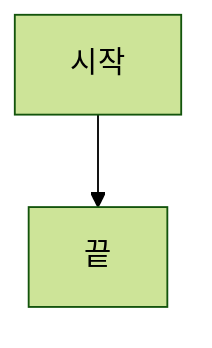
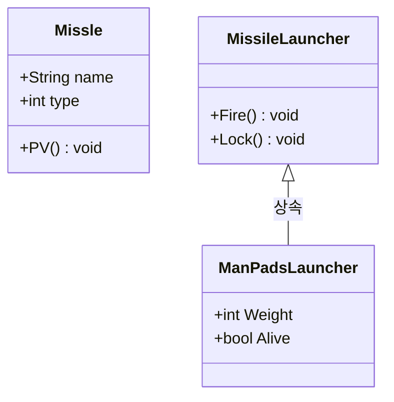
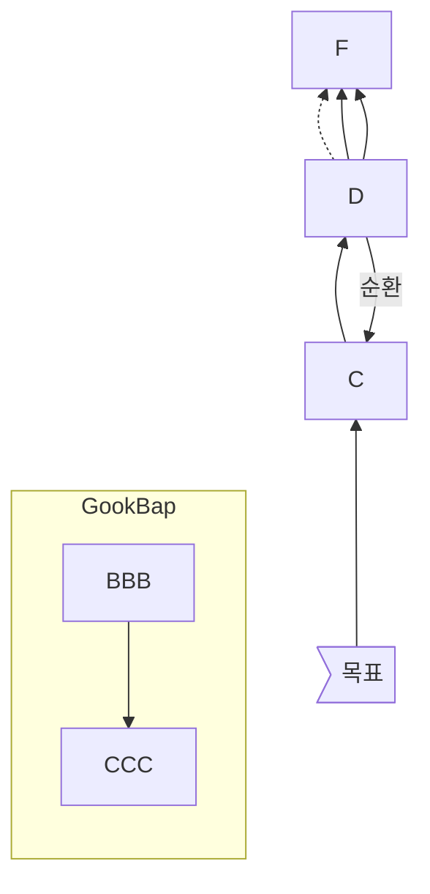
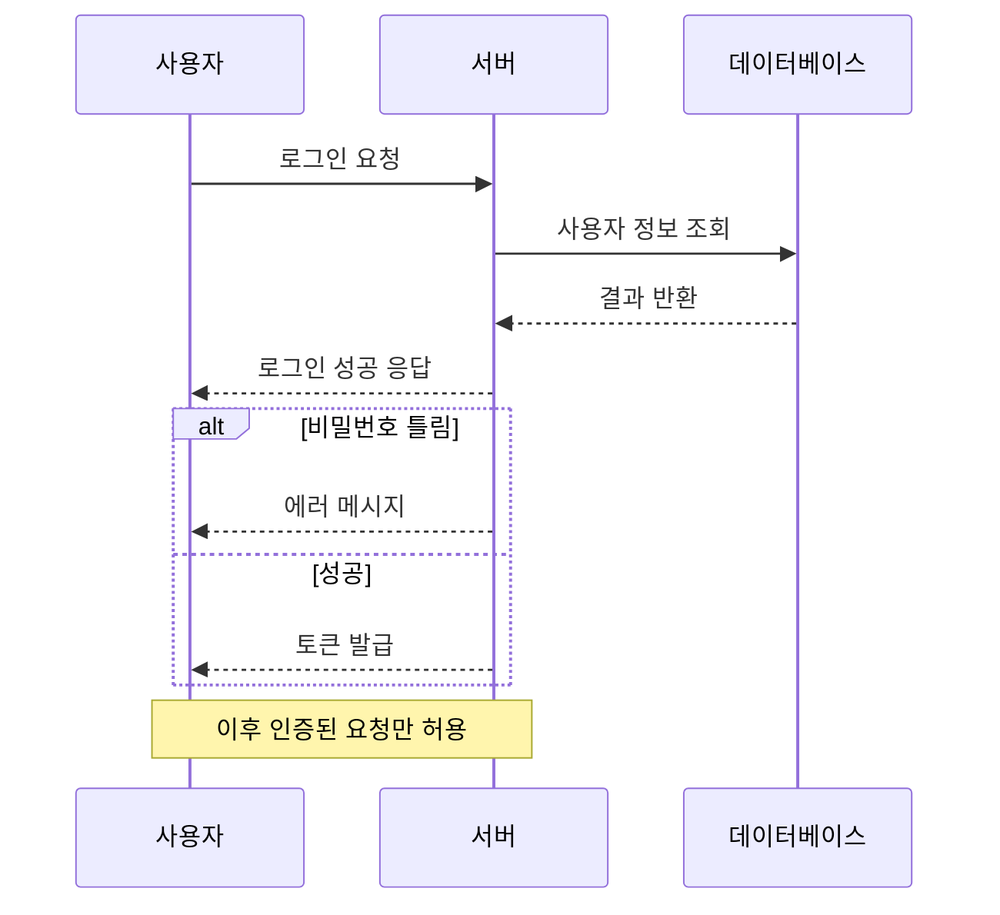

```mermaid
%%{init: {'theme':'forest'}}%%
graph TD
    A[시작] --> B[끝]


```

```mermaid
classDiagram
    class Missle {
        +String name
        +int type
        +PV() void
    }
    class MissileLauncher {
        +Fire() void
        +Lock() void
    }
    class ManPadsLauncher {
        +int Weight
        +bool Alive
    }
    MissileLauncher <|--  ManPadsLauncher : 상속
 classDef Missile fill:#d4edda,stroke:#28a745,stroke-width:2px,color:#155724
    classDef MissileLauncher fill:#f8d7da,stroke:#dc3545,stroke-width:2px,color:#721c24

```

```mermaid
flowchart BT
    subgraph GookBap
        BBB --> CCC
    end
    C --> D
    D -- 순환 --> C
    D -.-> F
    D --> F
    D --> F
    G>목표] --> C
```

```mermaid
sequenceDiagram
    participant U as 사용자
    participant S as 서버
    participant D as 데이터베이스

    U->>S: 로그인 요청
    S->>D: 사용자 정보 조회
    D-->>S: 결과 반환
    S-->>U: 로그인 성공 응답

    alt 비밀번호 틀림
        S-->>U: 에러 메시지
    else 성공
        S-->>U: 토큰 발급
    end

    Note over U,S: 이후 인증된 요청만 허용
```
