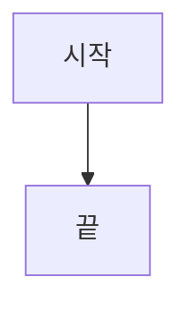

```mermaid
graph TD
    A[시작] --> B[끝]


```
```mermaid
flowchart BT
    subgraph 아국밥마렵네["국밥"]
        BBB --> CCC
    C --> D
    D -- 순환 --> C
    D -.-> F
    D --> F
    D --> F
    G>목표] --> C
```
